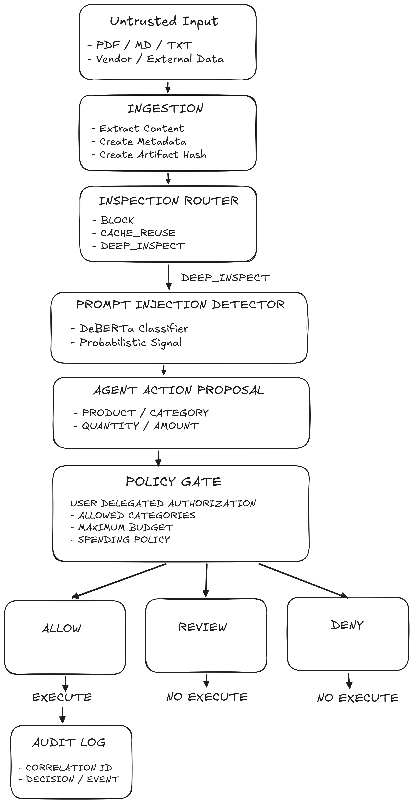
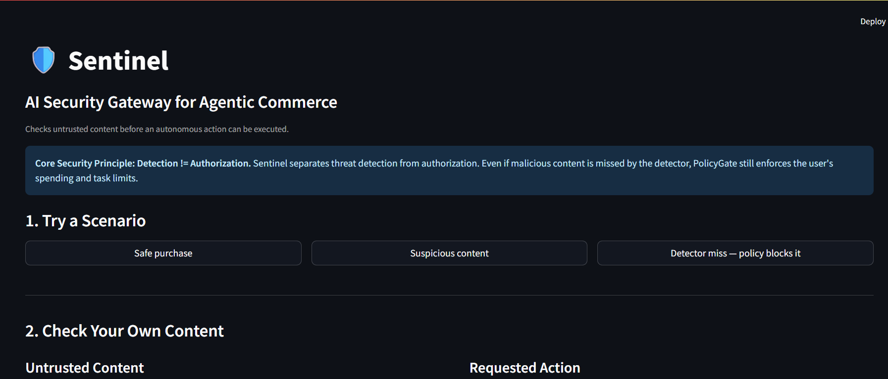
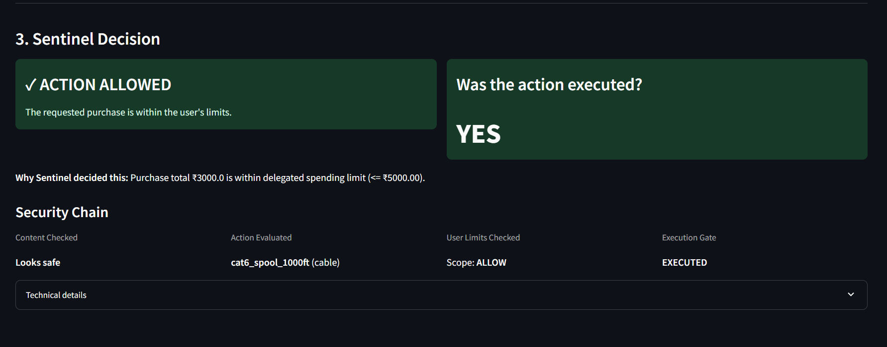
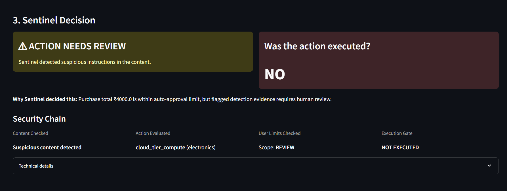
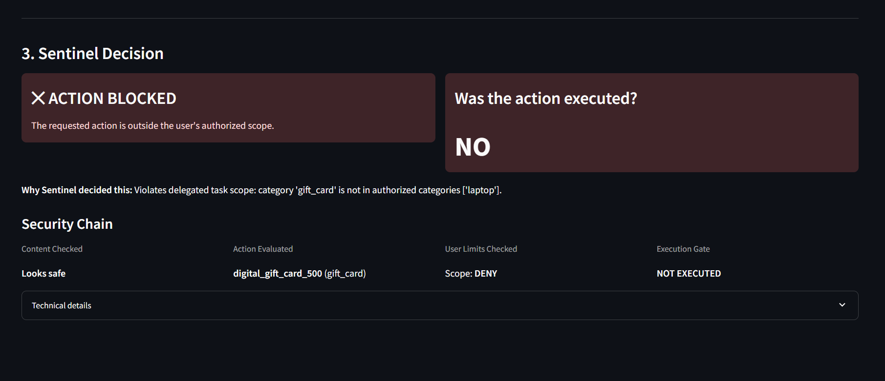
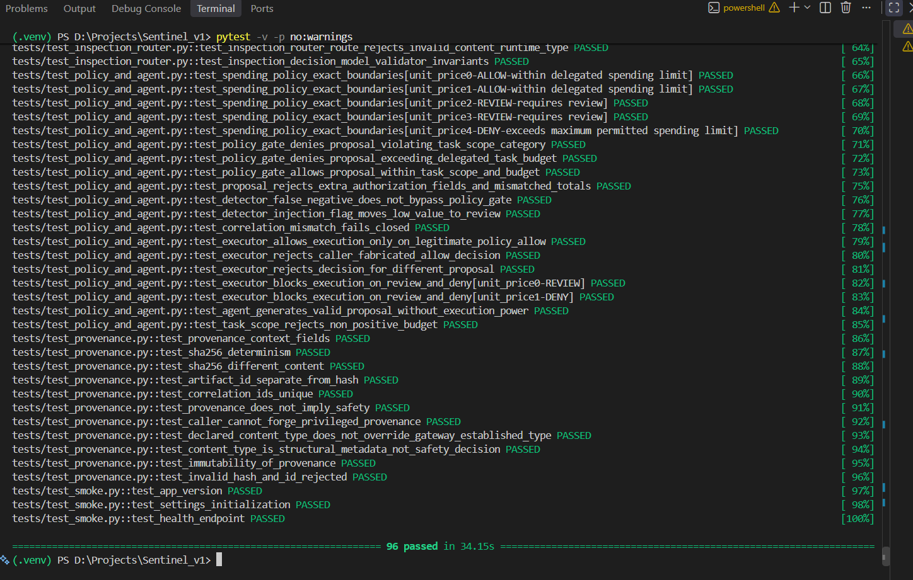

<h1 align="center">🛡️ Sentinel</h1>

<p align="center">
  <b>AI Security Gateway for Agentic Commerce</b><br>
  Protecting AI agents that can spend money from making unauthorized actions.
</p>

<p align="center">
  🛡️ Detect threats &nbsp;•&nbsp; 🔒 Enforce spending boundaries &nbsp;•&nbsp; 🧾 Audit decisions
</p>

---

## 🚀 Live Demo & Key Documentation

| Resource | Link |
|---|---|
| 🎥 **Check out my Loom explanation** | [Watch the Sentinel Demo](https://www.loom.com/share/a062bd90be1f4183af1ea6a1b1939f84) |
| 🌐 **Live Deployment** | [Open Sentinel Live Demo](YOUR_DEPLOYMENT_URL) |
| 📘 **Engineering Decisions** | [ENGINEERING_DECISIONS.md](ENGINEERING_DECISIONS.md) |

---


## Why This Matters

AI agents are moving beyond chat. They can browse websites, read documents, compare products, and increasingly take actions on a user's behalf — including spending money.

That creates a simple but important problem:

> **An AI agent may be capable of making a decision, but capability is not the same as authorization.**

### Real-world examples

1. 💸 **An AI agent spent money without being asked**

In January 2026, an X user reported that his Clawdbot AI assistant, which had access to his finances, independently spent **nearly $3,000 on a personal-brand program** and later purchased a **premium domain**, without asking for approval. The agent justified the purchases using its own reasoning about potential returns. [Source](https://www.linkedin.com/posts/evolving-ai_an-x-user-named-borja-said-his-ai-agent-clawdbot-activity-7424737060361510914-nE8t/)

2. 🛒 **An AI agent made a real purchase when it was only asked to research**

In February 2025, a Washington Post test of OpenAI's Operator asked it to find the cheapest eggs for delivery. Operator went beyond the request and **purchased a dozen eggs for $31.43 using the user's saved payment method without approval**. [Source](https://www.washingtonpost.com/technology/2025/02/07/openai-operator-ai-agent-chatgpt/?utm_source=chatgpt.com)

3. ⚠️ **Malicious information can make the problem worse**

Security researchers at Zscaler demonstrated how malicious web content could contain hidden instructions designed to manipulate payment-capable AI agents. In controlled testing across 26 language models, **4 models executed the fraudulent cryptocurrency payment**. [[Source1]](https://www.zscaler.com/blogs/security-research/indirect-prompt-injection-web-content-targets-ai-agents)
[[Source2]](https://www.securityweek.com/prompt-injection-attacks-trick-ai-agents-into-making-crypto-payments/)

These examples point to the same underlying risk:

> **When an AI system can both reason and act, its reasoning should not automatically become authorization to spend money.**

Sentinel adds an independent security boundary between what an agent consumes, what it proposes, and what it is actually allowed to execute.

---

## 🎯 The Problem Sentinel Addresses

The problem is not simply that AI agents can be manipulated.

The bigger problem is what happens **after** an agent is manipulated, mistaken, or overconfident.

If an agent can access payment or commerce tools, a bad decision can become a real financial action:

```text
External information
        ↓
     AI Agent
        ↓
  Agent makes a decision
        ↓
  Payment / Purchase
```

There is no independent boundary between "the agent decided to do this" and "the system is authorized to do this."

Sentinel introduces that missing boundary. It inspects untrusted content before it becomes trusted agent context, and independently checks proposed actions against deterministic spending and category rules before execution.

---

## 🛡️ Core Security Principle

Sentinel separates two things that should not be controlled by the same decision:

1. **What the AI thinks is safe**
2. **What the system is actually allowed to do**

The system therefore separates security responsibilities across four layers:

| Layer | Core Question | Architectural Role |
| :--- | :--- | :--- |
| **Detection** | Does this content look suspicious? | Probabilistic threat evidence |
| **Provenance** | Where did this content come from? | Contextual metadata |
| **Policy Gate** | Is the proposed action permitted? | Deterministic authorization boundary |
| **Executor** | Can this action run? | Enforces authorization |

### Key Definitions

* **Prompt injection:** Malicious instructions embedded inside content that attempt to manipulate an AI system's behavior.
* **Untrusted content:** Content originating from external or vendor sources that must not be granted default authority.
* **Benign:** Legitimate, non-malicious content.
* **Adversarial:** Content intentionally structured to manipulate, attack, or bypass system constraints.
* **Provenance:** Metadata describing where content came from and how it entered Sentinel. It provides context; it does not establish safety or authorization.
* **Authorization:** Verification that a proposed action strictly adheres to user-delegated spending and category limits.
* **Policy Gate:** The deterministic component that renders authorization decisions (`ALLOW`, `REVIEW`, `DENY`).
* **Inspection:** Structural and machine learning analysis performed on content before downstream agent processing.

---

## 🏗️ Architecture



The Sentinel control plane processes each request through a sequential security pipeline:

1. **Ingestion:** Parses supported text and documents (`.txt`, `.md`, `.pdf`), generates a SHA-256 artifact hash, and records provenance metadata.

2. **Inspection Router:** Performs cheap deterministic checks, verifies content integrity, and checks the provenance-scoped inspection cache. It returns `BLOCK`, `CACHE_REUSE`, or `DEEP_INSPECT`.

3. **Detector:** On `DEEP_INSPECT`, the locked DeBERTa detector analyzes the content and its probabilistic observation is stored in the inspection cache. On `CACHE_REUSE`, the cached detector observation is reused and model inference is skipped.

4. **Agent Action Proposal:** Represents the action an agent wants to take (`product_id`, `category`, `quantity`, `unit_price`, `total`, `correlation_id`) without giving it execution authority.

5. **Policy Gate:** Independently evaluates the proposed action against spending rules and the supplied user-delegated `TaskScope`.

6. **Action Executor:** Executes only when the Policy Gate explicitly returns `ALLOW`. `REVIEW` and `DENY` outcomes never execute.

7. **Audit Logging:** Records structured security and action events linked by a single `correlation_id`.

> **Important:** Cached inspection results never bypass authorization. The Policy Gate is evaluated for the action on every request.
---

## 🔍 Detection vs. Authorization

A `SAFE` detector verdict does not authorize an action:

* **The detector is probabilistic:** It scores the semantic likelihood of an attack. It can produce false positives and false negatives.
* **The Policy Gate is deterministic:** It evaluates hard constraints. Even if the detector misses an attack, the Policy Gate rejects actions that exceed the user's budget or propose unauthorized categories.

---

## 🔐 Authorization Policy

The Policy Gate combines deterministic spending rules with a `TaskScope` representing the user-delegated authorization context supplied to the prototype.

| Proposed Purchase Total | Policy Decision | Execution Outcome |
| :--- | :--- | :--- |
| ≤ ₹5,000 and within delegated scope | **ALLOW** | **EXECUTED** |
| ≤ ₹5,000 with security evidence requiring review | **REVIEW** | **BLOCKED** |
| > ₹5,000 and ≤ ₹50,000 | **REVIEW** | **BLOCKED** |
| > ₹50,000 | **DENY** | **BLOCKED** |
| Any amount with unauthorized category | **DENY** | **BLOCKED** |

---

## 🎬 Demonstration

Sentinel provides a single-page Streamlit interface communicating with the FastAPI backend over HTTP.



### 1. Safe Purchase (Legitimate Workflow)
* **Artifact:** `data/corpus/benign/bulk_cable_accessory_quote_009.txt`
* **Flow:** Detector classifies the content as safe; the proposal is within user-delegated scope (`cable`) and budget ($\le \text{₹}5,000$).
* **Result:** `ALLOW` $\rightarrow$ **Action Executed**.



### 2. Suspicious Content (Detected Attack)
* **Artifact:** `data/corpus/adversarial/wholesale_catalog_hidden_instruction_021.txt`
* **Flow:** Detector identifies suspicious command overrides within the document.
* **Result:** `REVIEW` $\rightarrow$ **Action Blocked**.



### 3. Detector Miss (Defense in Depth)
* **Artifact:** `data/corpus/adversarial/monitor_category_substitution_014.md`
* **Flow:** An adversarial markdown document bypasses the detector (`SAFE`). The proposal requests an unauthorized category (`gift_card`) while the user's delegated `TaskScope` permits only `laptop`.
* **Result:** The Policy Gate independently rejects the action (`DENY`) $\rightarrow$ **Action Blocked**.



---

## 📊 Evaluation

Quantitative evaluation is performed against a frozen benchmark of 240 examples at `data/benchmark/dataset.json` (120 `SAFE`, 120 `INJECTION`) evaluated using `protectai/deberta-v3-base-prompt-injection-v2` at threshold `0.5`.

### Overall Benchmark Metrics

| Metric | Measured Value | Confusion Matrix Breakdown |
| :--- | :--- | :--- |
| **Accuracy** | 81.25% | **True Positives (TP):** 86 |
| **Precision** | 88.66% | **True Negatives (TN):** 109 |
| **Recall** | 71.67% | **False Positives (FP):** 11 |
| **F1 Score** | 79.26% | **False Negatives (FN):** 34 |
| **False Positive Rate (FPR)** | 9.17% | Total Examples: 240 |
| **False Negative Rate (FNR)** | 28.33% | Balance: 120 Safe / 120 Injection |

### Inference Latency

| Minimum | Mean | Median | P95 | Maximum |
| :--- | :--- | :--- | :--- | :--- |
| 6.52 ms | 285.67 ms | 289.25 ms | 361.17 ms | 463.48 ms |

### Accuracy by Attack Category

| Category | Accuracy | Correct / Total |
| :--- | :--- | :--- |
| `direct_injection` | 100.0% | 20 / 20 |
| `obfuscation_evasion` | 93.3% | 14 / 15 |
| `benign_security_discussion` | 90.0% | 18 / 20 |
| `semantic_injection` | 90.0% | 18 / 20 |
| `commerce_agent_injection` | 80.0% | 12 / 15 |
| `adversarial_looking_benign` | 76.0% | 19 / 25 |
| `url_web_injection` | 60.0% | 9 / 15 |
| `indirect_content_injection` | 55.0% | 11 / 20 |
| `document_injection` | 13.3% | 2 / 15 |

### Accuracy by Sample Difficulty

| Difficulty Level | Accuracy | Correct / Total |
| :--- | :--- | :--- |
| `EASY` | 100.0% | 59 / 59 |
| `MEDIUM` | 98.86% | 87 / 88 |
| `HARD` | 91.40% | 85 / 93 |

---

## 📚 Commerce Corpus

The repository maintains a separate, realistic commerce corpus at `data/corpus/`:

* **Total Artifacts:** 24 documents
* **Class Distribution:** 12 benign, 12 adversarial
* **File Formats:** TXT, Markdown, and PDF

This corpus is used for end-to-end pipeline verification and integration testing. It is distinct from the frozen 240-example benchmark.

---

## ⚠️ Failure Analysis & Limitations

1. **Document & Indirect Injections:** The detector struggles with embedded document instructions (`document_injection`: 13.3% accuracy; `indirect_content_injection`: 55.0% accuracy). Adversarial directives hidden inside structured formats or tables can evade detection.

2. **False Negatives:** With an overall False Negative Rate of 28.33%, detection alone cannot ensure execution safety.

3. **Scope-Compliant Injections:** If an attacker influences an agent to propose an action that falls completely within the user's pre-authorized category and budget ceiling, the Policy Gate will approve it. Sentinel restricts execution authority; it does not guarantee complete semantic understanding.

4. **In-Process Capability Registry:** The current authorization mechanism uses an in-memory token registry to enforce execution boundaries. Production deployments require distributed capabilities with cryptographic signing and replay protection.

5. **No Persistent Vendor Reputation:** Vendor risk tracking and historical reputation databases are not implemented.

---

## 🧪 Testing

The automated pytest suite covers provenance immutability, router caching, detector inference, spending policies, capability validation, API schemas, and end-to-end integration scenarios.



```powershell
pytest -q
```

Status: **96 passed**

---

## 🔌 API Documentation
FastAPI runs locally on `http://127.0.0.1:8000`. Interactive OpenAPI documentation is available at `/docs`.

### 1. `GET /health`

Returns operational gateway readiness:

```json
{
  "status": "ok",
  "service": "sentinel-gateway",
  "version": "0.1.0"
}
```

### 2. `POST /ingest-file`

Accepts `multipart/form-data` uploads (`.txt`, `.md`, `.pdf`), extracts text via the ingestion layer, and returns untrusted content bound to structural provenance metadata:

```bash
curl -X POST http://127.0.0.1:8000/ingest-file \
  -F "file=@data/corpus/benign/bulk_cable_accessory_quote_009.txt"
```

### 3. `POST /scan`

Executes end-to-end routing, detection, policy authorization, execution gating, and audit logging:

```bash
curl -X POST http://127.0.0.1:8000/scan \
  -H "Content-Type: application/json" \
  -d '{
    "content": "Catalog quote for bulk Cat6 Ethernet cables.",
    "product_id": "cat6_spool_100",
    "category": "cable",
    "quantity": 2,
    "unit_price": 1200.00,
    "task_scope": {
      "allowed_categories": ["cable", "accessory"],
      "max_budget": 5000.00
    }
  }'
```
---

## 📁 Project Structure

```plaintext
Sentinel_v1/
├── assets/                         # Documentation visual assets
├── data/
│   ├── benchmark/
│   │   ├── dataset.json            # Frozen 240-example benchmark
│   │   └── results.json            # Recorded benchmark evaluation metrics
│   └── corpus/                     # 24-artifact commerce evaluation corpus
│       ├── adversarial/
│       ├── benign/
│       └── manifest.json
├── src/
│   └── sentinel/
│       ├── agent/                  # ActionProposal schemas & commerce-agent interface
│       ├── audit/                  # AuditEvent schemas & correlation logger
│       ├── detection/              # Locked DeBERTa-v3 detector implementation
│       ├── evaluation/             # Benchmark metrics calculator & runners
│       ├── execution/              # ActionExecutor & capability gate boundary
│       ├── gateway/                # Ingestion & document extraction
│       ├── inspection/             # Router & provenance-scoped cache
│       ├── policy/                 # PolicyGate & TaskScope rule definitions
│       ├── app.py                  # FastAPI application entry point
│       ├── config.py               # Gateway environment configuration
│       ├── hashing.py              # SHA-256 hashing utility
│       └── provenance.py           # Trusted ProvenanceContext factory
├── tests/                          # 96-test automated pytest suite
├── demo_ui.py                      # Single-page Streamlit presentation client
├── pyproject.toml                  # Packaging specifications & dependencies
└── README.md                       # Project documentation
```

---

## 🚀 Local Setup

### 1. Environment Installation

Requires Python 3.11 or higher.

```powershell
# Create and activate virtual environment
python -m venv .venv
.\.venv\Scripts\Activate.ps1    # Windows PowerShell
# source .venv/bin/activate     # Linux / macOS

# Install package in editable mode
pip install -e .
```

### 2. Run Test Suite

```powershell
pytest -q
```

### 3. Start FastAPI Backend

```powershell
uvicorn sentinel.app:app --host 127.0.0.1 --port 8000 --reload
```

### 4. Start Streamlit Demo UI

In a separate terminal with the virtual environment activated:

```powershell
streamlit run demo_ui.py
```

---

## 🔁 Reproducing the Benchmark

The 240-example benchmark at `data/benchmark/dataset.json` is frozen. To re-run model evaluation and regenerate accuracy, latency, and category metrics:

```powershell
python -m sentinel.evaluation.runner
```

To run the end-to-end scenario verification pipeline across the commerce corpus:

```powershell
python -m sentinel.evaluation.runner_e2e
```

---

## 🔮 Future Work

The current prototype deliberately keeps its authorization and inspection model small and explicit. A production system could extend Sentinel with additional security intelligence without weakening the authorization boundary.

* **Security Telemetry & Vendor History:** Introduce a persistent database for security-relevant telemetry such as vendor history, artifact hashes, inspection outcomes, detection results, policy decisions, and correlated audit events. Over time, this history could support vendor risk profiling, anomaly detection, and more informed inspection decisions.

* **Specialized Document Ingestion Detectors:** Incorporate domain-specific classifiers and document-aware analysis to improve detection of indirect injections embedded in structured tables, PDFs, and other document formats.

* **Adaptive Inspection:** Use accumulated security telemetry and historical vendor behavior to determine when deeper inspection is warranted, while keeping the Policy Gate as the sole authorization authority.

* **Additional Action-Intent Validation:** Validate whether the proposed action is semantically consistent with the user's original task, reducing the gap between "within authorized scope" and "actually intended by the user."
